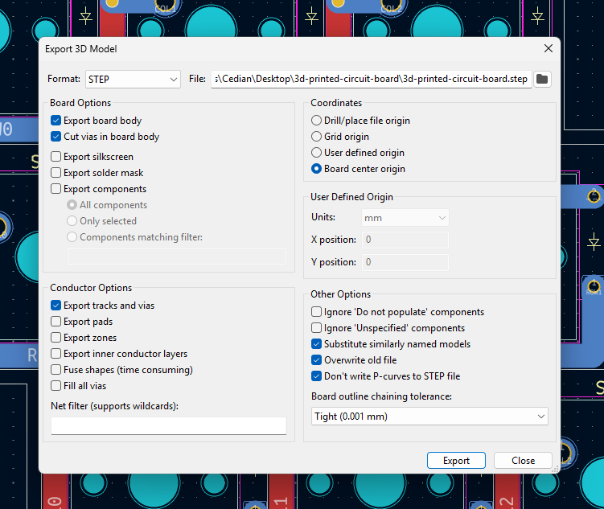

# 3D Printed Circuit Board

Work in progress 3D printable keyboard PCB. Traces are formed with copper tape guided by raised 3D printed tracks.

## Board properties

- Board thickness is set at `PCB Editor->Board setup->Physical Stackup->Dielectric 1->Thinkness`
- Trace height is set at `PCB Editor->Board setup->Physical Stackup->F.Cu/B.Cu->Thinkness`

Or they can be edited in CAD after exporting.

## Recomended export settings

